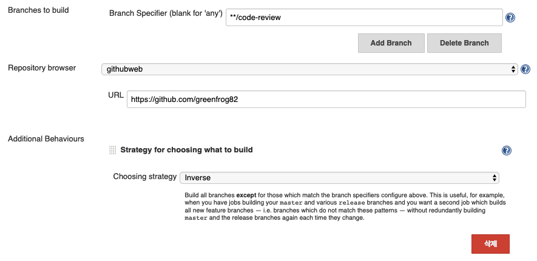

# How to trigger build with webhook

Github에 변경사항이 푸쉬되면 이를통해 Jenkin의 빌드를 유발할 수 있다. 이는 GitHub의 `WebHook`을 통해 가능하다.
여기서는 `free style`템플릿을 선택했다고 가정하고 설명을한다. 

## Set Webhook url to Github

Github의 설정이다. 우선 Webhook을 사용하려면 다음 절차를 따르자. 

1. Webhook을 설정하고자하는 레포지토리의 `Settings`의 `Webhooks` 메뉴를 선택한다. 
2. `Add webhook`버튼을 선택한다. 
3. `Payload URL`은 Github에 특정 이벤트가 발생하면 이를 전달받을 서버이다. 여기에 **Jenkins 서버 URL + /github-webhook/**을 작성한다. ex) http://ci-server.com/github-webhhok/
4. 기타 설정들은 추후 작성 .. 

## 소스 코드 관리 on Jenkin

Webhook을 통해 빌드를 수행하고자하는 Project로 이동하여 `소스 코드 관리`영역으로 이동하여 다음 절차를 수행한다.

1. Git 라디오 버튼 선택
2. Repositories
    1. `Repository URL`은 해당 Project가 빌드를 수행하기 위한 GitHub Repository의 URL을 작성한다. ex) git@github.com:greenfrog/TIL_DevOps.git
    2. `Credentials`는 해당 Github Repository에 인증하기 위한 방법을 선택하고 설정한다. 
3. `Repostiroy browser`에서 **githubweb** 선택
    1. `URL`은 GitHub Repository의 URL이다. ex) https://github.com/greenfrog/TIL_DevOps

### Additional Behaviours

소스 코드를 관리하기 위한 추가적인 옵션을 설정한다. 

#### Strategy for choosing what to build

**Choosing strategy**

빌드를 하기위한 소스코드를 선택하는 방법을 설정한다. 총 3가지 방법을 제공한다. 

* Ancestry 
* Default - `Branch Specifier`에 명시한 브랜치를 대상으로 빌드를 수행한다. 
* Inverse - `Branch Specifier`에 명시한 브랜치를 제외한 모든 브랜치를 대상으로 빌드를 수행한다. 

`Inverse` Choossing strategy를 사용하는 이유는 master 브랜치와 각종 release 브랜치를 빌드하는 Jenkins `Build Job`들이 있다고 가정할 때, 이외의 브랜치들을 대상으로 빌드를 하고 싶을 때 사용하면 유용하다. 앞의 그림의 경우 code-review 브랜치를 제외한 모든 브랜치를 대상으로 빌드를 수행한다. 

#### Merge before build

빌드를 수행하기 전, 현재 변경사항이 발생한 commit을 특정 브랜치와 merge할 수 있다.특정 브랜치에 직접 merge하지 않고 임시 commit을 만든다. 

* `Name of repository`는 로컬 또는 리모트 레포지토리 등 어떤 레포지토리를 이용할지 지정한다. origin으로 작성.
* `Branch to merge to`는 어떤 브랜치에 merge할지 지정한다. 앞서 언급한대로 지정한 브랜치에 직접 머지하지 않고 임시 commit을 만든다. 
* `Merge strategy`는 ?? 일단 `default`로 지정.
* `Fast-forward mode` 역시 기본값 `--ff`으로 일단 사용. 

## 빌드 유발 on Jenkins

`GitHub hook trigger for GITScm polling`을 선택한다. 이를 선택하면 Github의 Webhook이 전달되면 빌드를 수행한다. 

끝!

# Reference

* [DockerHub - Jenkins](https://hub.docker.com/r/jenkins/jenkins)
* [Adding a GitHub Webhook in Your Jenkins Pipeline
](https://dzone.com/articles/adding-a-github-webhook-in-your-jenkins-pipeline)
* [젠킨스 파이프라인 정리 - 1. 파이프라인 샘플 만들기](https://jojoldu.tistory.com/355)
* [젠킨스 파이프라인 정리 - 2. Scripted 문법 소개](https://jojoldu.tistory.com/356?category=777282)
* [Jenkins 로 빌드 자동화하기 1 - GitHub 에 push 되면 자동 빌드하도록 구성](https://yaboong.github.io/jenkins/2018/05/14/github-webhook-jenkins/)
* [Jenkins and github integration using webhooks](https://blog.tentamen.eu/jenkins-and-github-integration-using-webhooks/)
* [Jenkins - 빌드 유발(주기적인 빌드 설정)](http://blog.naver.com/PostView.nhn?blogId=special9486&logNo=220274932377)