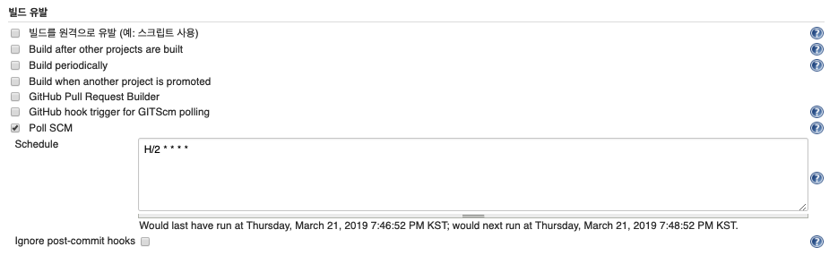

# How to set Jenkins

`1.651.3`

## 빌드 유발

`빌드 유발`설정은 자동으로 빌드를 실행하기 위한 조건을 설정한다. 

### Poll SCM

`Poll SCM`은 주기적으로 VCS(Version Console System)을 검사해서 변경사항이 존재할 때, 빌드를 실행하기위한 조건이다.  
주기는 위 그림에서 `Schedule`에 입력을 한다. 위 설정의 경우 매2분마다 빌드를 하기위한 변경사항을 찾고 변경사항이 존재할 때 빌드를 수행한다. 

## 소스 코드 관리

빌드를 하기위해 소스 코드를 가져오기 위한 VCS와 브랜치 정보들을 설정하는 메뉴이다.

### Additional Behaviours

소스 코드를 관리하기 위한 추가적인 옵션을 설정한다. 

#### Strategy for choosing what to build

**Choosing strategy**

빌드를 하기위한 소스코드를 선택하는 방법을 설정한다. 총 3가지 방법을 제공한다. 

* Ancestry 
* Default - `Branch Specifier`에 명시한 브랜치를 대상으로 빌드를 수행한다. 
* Inverse - `Branch Specifier`에 명시한 브랜치를 제외한 모든 브랜치를 대상으로 빌드를 수행한다. 

`Inverse` Choossing strategy를 사용하는 이유는 master 브랜치와 각종 release 브랜치를 빌드하는 Jenkins `Build Job`들이 있다고 가정할 때, 이외의 브랜치들을 대상으로 빌드를 하고 싶을 때 사용하면 유용하다. 앞의 그림의 경우 code-review 브랜치를 제외한 모든 브랜치를 대상으로 빌드를 수행한다. 

# Reference

* [Jenkins - 빌드 유발(주기적인 빌드 설정)](http://blog.naver.com/PostView.nhn?blogId=special9486&logNo=220274932377)